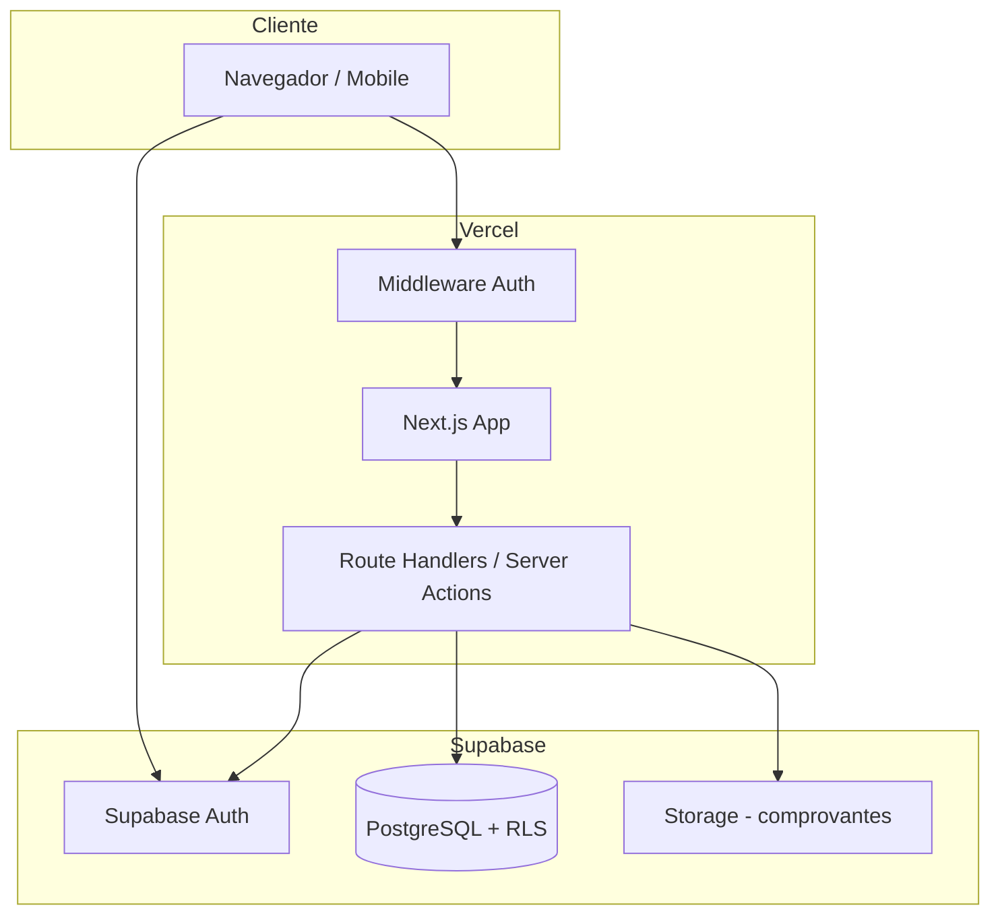
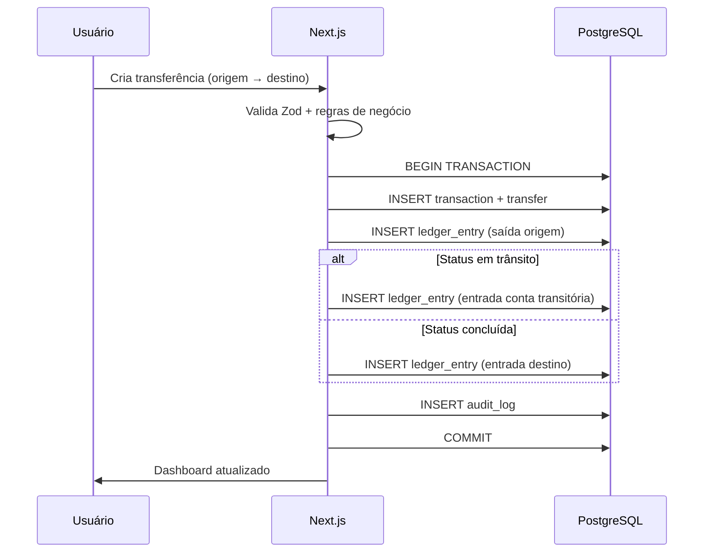
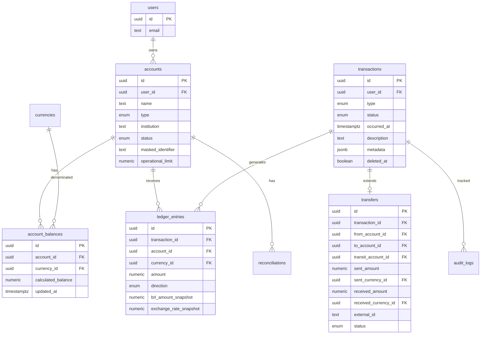
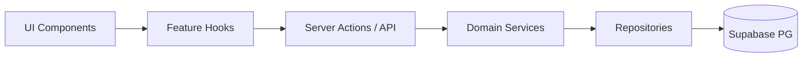

# Arquitetura — JairoBet

Documento de referência para implementação do sistema descrito em `PRD-jairobet.md`.

> **Nota:** Este documento foi escrito antes da revisão do PRD (v2). Antes do plano de desenvolvimento, alinhar especialmente: natureza **pessoal** (não ERP), lançamentos **manuais** com edição/exclusão livre, entidade **titular** vinculada a cada conta, e simplificação de auditoria/logs. Ver seção de ajustes pendentes no final.

---

## 1. Resumo executivo

| Decisão | Escolha | Motivo |
|---------|---------|--------|
| Linguagem | **TypeScript** (strict) | Tipagem forte em regras financeiras e contratos de API |
| Frontend + API | **Next.js 15** (App Router) | Deploy nativo na Vercel, SSR, Route Handlers, bom DX |
| Banco + Auth | **Supabase** (PostgreSQL + Auth + Storage) | RLS nativo, backup, MFA, storage para comprovantes |
| Hospedagem | **Vercel** | CI/CD simples, edge middleware, bom para projeto pessoal |
| UI | **Tailwind + shadcn/ui** (adaptado do DESIGN_SYSTEM.md) | Base pronta, dark/light, componentes acessíveis |
| Validação | **Zod** | Schemas compartilhados entre formulário e API |
| Estado servidor | **TanStack Query** | Cache, revalidação, loading/error states |
| Formulários | **React Hook Form** | Performance em formulários longos (transferências) |

**Princípio central (a revisar):** saldos derivados de movimentações lançadas manualmente. Edição e exclusão são permitidas; recálculo automático de saldos após cada alteração.

---

## 2. Contexto do produto

Sistema pessoal para conciliar patrimônio distribuído entre:

- Contas bancárias
- Corretoras de cripto (multi-moeda)
- Plataformas externas
- Contas transitórias (valores em trânsito)

**Regra de ouro do domínio:**

> Transferir dinheiro entre contas próprias não representa lucro nem prejuízo.

O sistema calcula patrimônio operacional, capital líquido aportado e resultado acumulado a partir do ledger, nunca apenas de saldos editáveis.

---

## 3. Visão de alto nível



### Fluxo de uma transferência



---

## 4. Stack detalhada

### 4.1 Next.js (App Router)

- **Server Components** para telas de leitura (dashboard, listagens).
- **Server Actions** para mutações simples (criar conta, conciliar).
- **Route Handlers** (`/api/*`) quando precisar de endpoints REST explícitos (exportação CSV, webhooks futuros).
- **Middleware** (`middleware.ts`): proteger rotas autenticadas, refresh de sessão Supabase.

Estrutura de rotas sugerida:

```
src/app/
├── (auth)/
│   ├── login/
│   ├── register/          # opcional no MVP (single user)
│   └── mfa/
├── (app)/
│   ├── layout.tsx         # sidebar + bottom nav
│   ├── page.tsx           # dashboard
│   ├── contas/
│   ├── movimentacoes/
│   ├── transferencias/
│   ├── conciliacao/
│   ├── relatorios/
│   └── configuracoes/
└── api/
    └── export/
```

### 4.2 Supabase

| Recurso | Uso |
|---------|-----|
| **Auth** | Email/senha, MFA (TOTP), sessão JWT |
| **PostgreSQL** | Dados financeiros, ledger, auditoria |
| **RLS** | Isolamento por `user_id` (preparado para multi-usuário futuro) |
| **Storage** | Comprovantes (PDF/imagem), path: `{user_id}/{transaction_id}/` |
| **Edge Functions** | *Fase 2+* — jobs agendados (alertas, cotação) |

Variáveis de ambiente:

```
NEXT_PUBLIC_SUPABASE_URL
NEXT_PUBLIC_SUPABASE_ANON_KEY
SUPABASE_SERVICE_ROLE_KEY   # apenas server-side, nunca no client
```

### 4.3 Bibliotecas complementares

| Lib | Uso |
|-----|-----|
| `@supabase/ssr` | Cookies de sessão no App Router |
| `decimal.js` ou `dinero.js` | Aritmética monetária sem float |
| `date-fns` | Datas e filtros de período |
| `recharts` | Gráficos do dashboard |
| `lucide-react` | Ícones (já no design system) |
| `next-themes` | Dark/light mode |
| `sonner` | Toasts |

---

## 5. Modelo de domínio

### 5.1 Conceitos

| Conceito | Descrição |
|----------|-----------|
| **Account** | Conta lógica (banco, corretora, plataforma, transitória) |
| **AccountBalance** | Saldo por moeda dentro de uma conta |
| **Transaction** | Evento de negócio visível ao usuário |
| **LedgerEntry** | Lançamento contábil que altera saldo calculado |
| **Transfer** | Especialização de transaction com par origem/destino |
| **Reconciliation** | Snapshot de conciliação manual |
| **ExchangeRateSnapshot** | Cotação congelada no momento do lançamento |

### 5.2 Tipos de movimentação (enum `transaction_type`)

```
capital_deposit      # aporte
capital_withdrawal   # retirada pessoal
transfer             # entre contas próprias
conversion           # troca de moeda na corretora
cashback
bonus
fee
balance_adjustment   # ajuste com justificativa
```

### 5.3 Status de transferência

```
scheduled | sent | processing | completed | cancelled | failed | under_review
```

### 5.4 Impacto no resultado financeiro

| Tipo | Afeta patrimônio | Afeta capital aportado | Afeta resultado |
|------|------------------|------------------------|-----------------|
| Aporte | + | + | não |
| Retirada | − | − | não |
| Transferência interna | neutro (consolidado) | não | não |
| Taxa | − | não | − |
| Cashback (recebido) | + | não | + |
| Bônus (creditado) | +* | não | +* |
| Conversão | neutro** | não | − (só taxa/spread) |
| Ajuste | corrige saldo | não | pode |

\* Bônus promocional vs. saldo retirável controlados por campo `withdrawable`.
\** Patrimônio total preservado; custo de conversão registrado como taxa.

### 5.5 Conta transitória e valores em trânsito

Quando uma transferência sai da origem mas ainda não chegou ao destino:

1. **Saída** na conta de origem (ledger negativo).
2. **Entrada** na conta transitória vinculada ao `transfer_id`.
3. Ao confirmar recebimento: **saída** da transitória + **entrada** no destino.

Isso evita duplicar patrimônio e atende a regra #7 do PRD.

Patrimônio operacional inclui saldos em contas transitórias.

---

## 6. Modelo de dados (PostgreSQL)

### 6.1 Diagrama simplificado



### 6.2 Tabelas principais

#### `currencies`
Moedas e criptoativos (BRL, USDT, BTC…).

```sql
code          text UNIQUE   -- 'BRL', 'USDT'
name          text
symbol        text
type          enum ('fiat', 'crypto')
decimal_places smallint
```

#### `accounts`
```sql
user_id, name, type (bank|broker|platform|transit),
institution, default_currency_id, status,
masked_identifier, notes, operational_limit,
initial_balance_date, closed_at
```

#### `account_balances`
Saldo **calculado** (derivado do ledger, atualizado por trigger ou job).

```sql
account_id, currency_id, calculated_balance
```

> No MVP: saldo recalculado via `SUM(ledger_entries)` ou trigger após insert. Evitar saldo editável direto.

#### `transactions`
Cabeçalho do evento de negócio.

```sql
user_id, type, status, occurred_at, description,
metadata (jsonb), deleted_at (soft delete)
```

#### `ledger_entries`
Fonte da verdade para saldos.

```sql
transaction_id, account_id, currency_id,
amount (numeric, sempre positivo),
direction (debit|credit),
brl_amount_snapshot, exchange_rate_snapshot,
created_at
```

Convenção: `credit` aumenta saldo da conta, `debit` diminui.

#### `transfers`
Detalhes específicos de transferência.

```sql
transaction_id, from_account_id, to_account_id,
transit_account_id (nullable),
sent_amount, sent_currency_id,
received_amount, received_currency_id,
fee_amount, fee_currency_id,
method, external_id (unique per user),
sent_at, received_at, status
```

#### `cashbacks`, `bonuses`, `fees`
Tabelas de extensão ou `metadata` estruturado em `transactions`.

**Recomendação MVP:** tabelas de extensão (`cashbacks`, `bonuses`) para filtros e relatórios; `fees` podem ser ledger entries + registro em `transaction_fees`.

#### `reconciliations`
```sql
account_id, currency_id, reconciled_at,
calculated_balance, reported_balance, difference,
notes, created_by
```

#### `audit_logs`
```sql
user_id, entity_type, entity_id, action,
old_values (jsonb), new_values (jsonb), created_at
```

Imutável — sem UPDATE/DELETE para usuários.

#### `exchange_rates` (opcional no MVP)
Cotação manual ou importada; cada `ledger_entry` guarda snapshot.

### 6.3 Índices importantes

```sql
ledger_entries (account_id, currency_id, created_at)
transactions (user_id, occurred_at DESC)
transactions (user_id, type, status)
transfers (external_id, user_id) UNIQUE WHERE external_id IS NOT NULL
reconciliations (account_id, reconciled_at DESC)
```

### 6.4 Views para dashboard (fase 1.5)

- `v_account_summary` — saldo por conta/moeda + BRL convertido
- `v_pending_transfers` — transferências não concluídas
- `v_monthly_result` — agregação por mês

Views simplificam queries do dashboard sem duplicar lógica no frontend.

---

## 7. Regras de negócio na aplicação

Camada `src/lib/domain/` com funções puras testáveis:

```
calculateOperationalEquity(balances, transitBalances, rates)
calculateNetCapital(deposits, withdrawals)
calculateAccumulatedResult(equity, netCapital)
calculateROI(result, netCapital)
calculatePlatformResult(...)
validateTransfer(transfer, accounts, balances)
detectDuplicateTransfer(externalId)
```

### Validações críticas (server-side sempre)

1. Conta encerrada não recebe lançamentos.
2. Transferência `completed` exige `received_amount`.
3. `external_id` duplicado → rejeitar.
4. Saldo negativo → permitir com flag `warning` (regra PRD #9).
5. Ajuste de saldo exige `reason` (mín. 10 caracteres).
6. Soft delete apenas; auditoria preservada.
7. Cotação obrigatória para moedas ≠ BRL no momento do lançamento.

### Cálculo de saldo

```
saldo_conta_moeda = SUM(credits) - SUM(debits)
```

Recalcular em batch noturno (sanity check) via Edge Function futura.

---

## 8. Segurança

### 8.1 Autenticação

| Recurso | Implementação |
|---------|---------------|
| Login email/senha | Supabase Auth |
| MFA (2FA) | Supabase TOTP — habilitar após primeiro login |
| Sessão | Cookies httpOnly via `@supabase/ssr` |
| Bloqueio por tentativas | Supabase built-in + rate limit Vercel |
| Logout | Invalidar sessão + limpar cookies |

### 8.2 Autorização (RLS)

Todas as tabelas com `user_id`:

```sql
CREATE POLICY "users_own_data" ON accounts
  FOR ALL USING (auth.uid() = user_id);
```

- **anon key** no client: apenas SELECT/INSERT/UPDATE permitidos por RLS.
- **service role**: somente em scripts de migração/admin local; nunca expor ao browser.
- Storage: policy por `{user_id}/*`.

### 8.3 Dados sensíveis

Conforme PRD — **não armazenar**:

- Senhas de bancos/corretoras/plataformas
- Chaves privadas, seed phrases, códigos 2FA de terceiros

Armazenar apenas:

- Nome/identificação mascarada da conta
- Saldos e movimentações informados manualmente
- Comprovantes em Storage (acesso restrito)

### 8.4 Auditoria e integridade

- `audit_logs` em toda mutação financeira
- `deleted_at` em transactions (soft delete)
- Transações DB (`BEGIN/COMMIT`) para operações multi-tabela
- Checksums opcionais em exports

### 8.5 Headers e hardening (Vercel)

```
Content-Security-Policy
X-Frame-Options: DENY
Strict-Transport-Security
```

Configurar em `next.config.ts` e Supabase dashboard.

---

## 9. Design system — adaptação

O `DESIGN_SYSTEM.md` veio do projeto "World Cup Bets". Reutilizar a **estrutura**, adaptar a **identidade** para finanças.

### 9.1 O que manter

- Arquitetura de componentes: `src/shared/components/ui/` + `layout/`
- shadcn/ui + Tailwind + tokens CSS
- Dark mode padrão + light mode (`next-themes`)
- Layout responsivo: `DesktopSidebar` + `BottomNav`
- Skeleton, toasts (Sonner), animações `slide-up` / `fade-in`
- Lucide React para ícones

### 9.2 O que adaptar

| Original (Copa) | JairoBet (Finanças) |
|-----------------|---------------------|
| Dourado como CTA principal | Manter dourado como destaque premium ou trocar por azul profundo — decisão visual na implementação |
| Verde "campo" | Verde semântico `--success` (entradas, lucro) |
| Troféu / hero Copa | Dashboard com cards de patrimônio e gráficos |
| Bebas Neue (display) | Usar para valores monetários grandes (patrimônio, ROI) |
| `text-gradient-gold` | `text-gradient-gold` em KPIs principais |

### 9.3 Semântica de cores no produto

| Situação | Cor (token) |
|----------|-------------|
| Entrada / lucro | `--success` |
| Saída / taxa | `--destructive` ou tom neutro |
| Pendente / em trânsito | `--warning` |
| Divergência conciliação | `--destructive` + badge |
| Transferência interna | `--accent` ou `--muted` |
| Capital aportado | `--primary` |

### 9.4 Estrutura de pastas UI

```
src/
├── shared/
│   ├── components/
│   │   ├── ui/           # shadcn (do design system)
│   │   └── layout/       # Sidebar, Header, PageContainer
│   ├── hooks/
│   └── lib/
│       ├── supabase/
│       ├── domain/       # regras de negócio puras
│       └── money/        # Decimal, formatação BRL
├── features/
│   ├── accounts/
│   ├── transfers/
│   ├── dashboard/
│   ├── movements/
│   ├── reconciliation/
│   └── reports/
└── app/
```

---

## 10. Camadas da aplicação



| Camada | Responsabilidade |
|--------|------------------|
| **UI** | Renderização, formulários, feedback visual |
| **Feature hooks** | TanStack Query, composição de dados |
| **Server Actions** | Orquestração, auth check, validação Zod |
| **Domain** | Regras financeiras puras (sem I/O) |
| **Repository** | SQL/Supabase client, mapeamento tipado |

**Testes prioritários:** `domain/` (unit) e fluxos de transferência/conciliação (integration).

---

## 11. APIs e contratos

### Server Actions (preferencial no MVP)

```typescript
// Exemplos de assinaturas
createAccount(input: CreateAccountInput): Promise<Account>
createTransfer(input: CreateTransferInput): Promise<Transfer>
confirmTransferReceipt(transferId: string, received: Money): Promise<void>
reconcileAccount(input: ReconcileInput): Promise<Reconciliation>
softDeleteTransaction(id: string, reason: string): Promise<void>
```

### Route Handlers

| Endpoint | Método | Uso |
|----------|--------|-----|
| `/api/export/transactions` | GET | CSV de movimentações |
| `/api/export/result` | GET | CSV relatório resultado |
| `/api/health` | GET | Health check |

Exportação CSV no MVP; Excel/PDF em fase posterior.

---

## 12. Dashboard e performance

### Estratégia de carregamento

1. **Dashboard shell** — Server Component com KPIs via view SQL agregada.
2. **Gráficos** — client component com dados pré-buscados.
3. **Listagens** — paginação cursor-based (`occurred_at`, `id`).
4. **Stale-while-revalidate** — TanStack Query `staleTime: 30s` para contas.

### Meta

Dashboard inicial < 2s com até 5.000 movimentações (índices + views + paginação).

---

## 13. Alertas (MVP simplificado)

Sem push/e-mail na v1. Alertas **in-app**:

| Alerta | Gatilho |
|--------|---------|
| Transferência pendente | `status != completed` há > N dias |
| Conta sem conciliação | última conciliação > 7 dias |
| Saldo negativo | `calculated_balance < 0` |
| Divergência | `|difference| > threshold` na conciliação |
| Cotação ausente | moeda sem rate no lançamento |

Implementar como query `v_alerts` + badge no Header.

---

## 14. Escopo por fases

### Fase 0 — Fundação (semana 1–2)

- [ ] Scaffold Next.js + TypeScript strict
- [ ] Supabase project + migrations iniciais
- [ ] Auth (login + MFA)
- [ ] Design system adaptado (tokens, layout, tema)
- [ ] RLS em todas as tabelas
- [ ] Estrutura de pastas `features/` + `domain/`

### Fase 1 — MVP Core (semana 3–6)

Alinhado ao PRD §19:

- [ ] CRUD contas (banco, corretora, plataforma, transitória)
- [ ] Moedas + cotação manual
- [ ] Saldo inicial + ledger
- [ ] Aportes e retiradas
- [ ] Transferências (com fluxo em trânsito)
- [ ] Conversão de moedas
- [ ] Cashback, bônus, taxas
- [ ] Conciliação manual
- [ ] Dashboard consolidado
- [ ] Resultado por período e por plataforma
- [ ] Exportação CSV
- [ ] Auditoria básica

### Fase 2 — Qualidade (semana 7–8)

- [ ] Testes domain + integração transferências
- [ ] Alertas in-app completos
- [ ] Relatórios PDF/Excel
- [ ] Upload comprovantes (Storage)
- [ ] Recálculo batch de saldos

### Fase 3 — Evoluções (pós-validação)

Conforme PRD §20: import OFX/CSV, cotação automática, conciliação assistida, notificações e-mail.

---

## 15. Ambientes e deploy

| Ambiente | Supabase | Vercel |
|----------|----------|--------|
| **Local** | Supabase CLI (`supabase start`) | `next dev` |
| **Preview** | Projeto staging | Preview branches |
| **Production** | Projeto prod | `main` branch |

### CI mínimo (GitHub Actions)

1. `pnpm lint`
2. `pnpm typecheck`
3. `pnpm test` (domain)
4. Deploy automático Vercel on push

### Migrations

Versionadas em `supabase/migrations/`. Aplicar via `supabase db push` (local) e Supabase CLI no CI para staging/prod.

---

## 16. Decisões explícitas (ADRs resumidos)

### ADR-001: Ledger em vez de saldo editável

**Decisão:** saldos derivados de `ledger_entries`.
**Motivo:** auditoria, conciliação, rastreio de transferências pareadas.
**Trade-off:** mais complexidade inicial; ganho em confiabilidade.

### ADR-002: Next.js monolito vs. frontend + API separados

**Decisão:** monolito Next.js com Server Actions.
**Motivo:** projeto pessoal, um deploy, menos overhead.
**Trade-off:** acoplamento; aceitável no escopo atual.

### ADR-003: Supabase vs. Prisma + Postgres avulso

**Decisão:** Supabase nativo.
**Motivo:** Auth, RLS, Storage, backup integrados.
**Trade-off:** vendor lock-in moderado; mitigado por SQL padrão.

### ADR-004: Conta transitória como entidade

**Decisão:** tipo `transit` em `accounts`, não apenas status.
**Motivo:** patrimônio em trânsito visível sem duplicação.
**Trade-off:** mais contas para gerenciar; UX pode agrupar automaticamente.

### ADR-005: Single user com RLS multi-tenant

**Decisão:** `user_id` em todas as tabelas desde o dia 1.
**Motivo:** segurança e possível expansão futura sem migração dolorosa.

---

## 17. Riscos e mitigações

| Risco | Mitigação |
|-------|-----------|
| Erros de aritmética float | `numeric` no PG + `decimal.js` no TS |
| Lógica de resultado incorreta | Testes unitários em `domain/`, exemplos do PRD como fixtures |
| RLS mal configurado | Testes de policy + checklist de migration |
| Scope creep do MVP | Fase 1 estritamente alinhada ao PRD §19 |
| Design system desalinhado | Renomear tokens, manter estrutura shadcn |
| Performance do dashboard | Views SQL + paginação desde o início |

---

## 18. Métricas de sucesso técnico

- [ ] Usuário responde às 11 perguntas do PRD §22 em < 30s via dashboard
- [ ] 100% das mutações financeiras com `audit_log`
- [ ] Zero credenciais de terceiros no banco
- [ ] MFA habilitado em produção
- [ ] Transferência origem→trânsito→destino reconciliável ponta a ponta

---

## 19. Próximo passo

Este documento define **o quê** e **como** construir. O próximo artefato será o **plano de ação de desenvolvimento** (`plano-desenvolvimento.md`), com:

- Ordem exata de tarefas
- Estimativas por sprint
- Checklist de migrations
- Critérios de "pronto" por feature
- Setup inicial passo a passo (repo, Supabase, Vercel)

---

## 20. Ajustes pendentes (pós PRD v2)

| Tópico | Antes (v1) | Alinhar com PRD v2 |
|--------|------------|---------------------|
| Auditoria | `audit_logs` imutáveis | Opcional / mínima; sem trilha corporativa |
| Exclusão | Soft delete obrigatório | Exclusão real com confirmação |
| Usuários | Single user | **Operador** (login) + **Titulares** (vinculados às contas) |
| Tipos de conta | "Plataforma externa" | **Casa de apostas** explícita |
| Rigidez | Ledger enterprise | Modelo mais simples; saldo recalculado |
| MFA | Obrigatório em prod | Desejável, não MVP |
| Segurança | Nível financeiro | Nível app pessoal (login + RLS) |

---

*Versão: 1.0 — Junho/2026 — aguardando alinhamento com PRD v2 antes do plano de desenvolvimento*