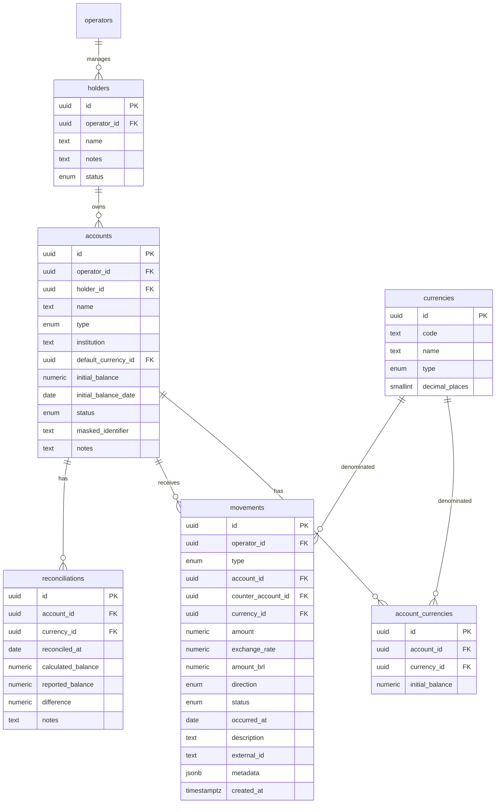
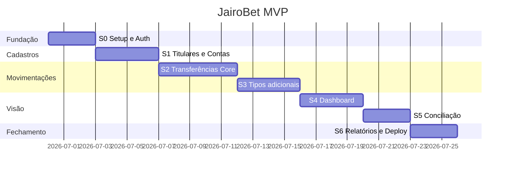

# Plano de Desenvolvimento — JairoBet

Roadmap de implementação alinhado ao `PRD-jairobet.md`. Foco: **começar rápido**, **uso pessoal**, **lançamentos manuais** com edição/exclusão livre.

---

## 1. Princípios de implementação

| Princípio | Na prática |
|-----------|------------|
| Simples primeiro | Uma tabela `movements` no MVP; sem ledger enterprise |
| Manual | Formulários rápidos; nada de integração automática |
| Corrigível | Editar e excluir com confirmação; saldos recalculados |
| Titular em tudo | Toda conta tem `holder_id`; filtros por titular na UI |
| Seguro o suficiente | Login Supabase + RLS; sem credenciais de terceiros |
| Entregar em fatias | Cada sprint termina com algo usável no dia a dia |

### Stack (confirmada)

```
Next.js 15 (App Router) + TypeScript
Supabase (Auth + PostgreSQL + RLS)
Vercel (deploy)
Tailwind + shadcn/ui (DESIGN_SYSTEM.md adaptado)
Zod + React Hook Form + TanStack Query
decimal.js (valores monetários)
date-fns + recharts
pnpm
```

---

## 2. Modelo de dados (MVP simplificado)

Sem auditoria imutável. Saldos **recalculados** a partir de movimentações + saldo inicial.



### Tipos de movimentação (`movement_type`)

```
initial_balance   # criado junto com a conta (opcional separar)
capital_deposit   # aporte
capital_withdrawal
transfer
conversion
cashback
bonus
fee
balance_adjustment
```

### Tipos de conta (`account_type`)

```
bank | crypto | betting
```

> **Trânsito no MVP:** usar `status = pending` na transferência, sem conta transitória dedicada. Valor sai da origem na criação; só entra no destino ao confirmar recebimento.

### Regra de saldo

```text
saldo(conta, moeda) =
  saldo_inicial
+ SUM(entradas concluídas)
− SUM(saídas concluídas)
± ajustes
```

Transferência `pending`: debita origem; credita destino **somente** quando status → `completed`.

---

## 3. Estrutura do repositório

```
jairobet/
├── src/
│   ├── app/
│   │   ├── (auth)/login/
│   │   ├── (app)/
│   │   │   ├── layout.tsx
│   │   │   ├── page.tsx              # dashboard
│   │   │   ├── titulares/
│   │   │   ├── contas/
│   │   │   ├── movimentacoes/
│   │   │   ├── transferencias/
│   │   │   ├── conciliacao/
│   │   │   ├── relatorios/
│   │   │   └── configuracoes/
│   │   └── api/export/[type]/route.ts
│   ├── features/
│   │   ├── auth/
│   │   ├── holders/
│   │   ├── accounts/
│   │   ├── movements/
│   │   ├── transfers/
│   │   ├── reconciliation/
│   │   ├── dashboard/
│   │   └── reports/
│   └── shared/
│       ├── components/ui/            # shadcn
│       ├── components/layout/        # sidebar, bottom nav, header
│       ├── lib/
│       │   ├── supabase/
│       │   ├── money/
│       │   └── domain/               # cálculos puros
│       └── types/
├── supabase/
│   └── migrations/
├── PRD-jairobet.md
├── arquitetura.md
├── DESIGN_SYSTEM.md
└── plano-desenvolvimento.md
```

---

## 4. Visão das sprints

| Sprint | Duração estimada | Entrega principal |
|--------|------------------|-------------------|
| **S0** | 2–3 dias | Projeto rodando + login + layout |
| **S1** | 3–4 dias | Titulares, moedas, contas |
| **S2** | 4–5 dias | Movimentações core (aporte, retirada, transferência) |
| **S3** | 3–4 dias | Cashback, bônus, taxas, conversão, ajuste |
| **S4** | 3–4 dias | Dashboard + filtros por titular |
| **S5** | 2–3 dias | Conciliação + alertas in-app |
| **S6** | 2–3 dias | Relatórios + export CSV + deploy prod |

**Total estimado:** 3–4 semanas em ritmo part-time.



---

## 5. Sprint 0 — Fundação

**Objetivo:** ambiente local funcionando, autenticação e shell da aplicação.

### Tarefas

- [ ] **S0.1** Criar projeto Next.js 15 com TypeScript strict, Tailwind, App Router
- [ ] **S0.2** Configurar pnpm, ESLint, Prettier, path alias `@/`
- [ ] **S0.3** Criar projeto Supabase (local com CLI + projeto cloud staging)
- [ ] **S0.4** Instalar `@supabase/ssr`, configurar client server/browser
- [ ] **S0.5** Migration `001_init.sql`: extensão `uuid-ossp`, função `auth.uid()` helper
- [ ] **S0.6** Tela de login (email/senha)
- [ ] **S0.7** Middleware de rotas protegidas
- [ ] **S0.8** Adaptar design system: tokens CSS, fontes (Outfit, Space Grotesk), dark mode
- [ ] **S0.9** Layout autenticado: `DesktopSidebar`, `BottomNav`, `Header`, `PageContainer`
- [ ] **S0.10** Menu de navegação: Dashboard, Titulares, Contas, Movimentações, Transferências, Conciliação, Relatórios, Configurações
- [ ] **S0.11** Conectar repositório Git + projeto Vercel (preview deploy)
- [ ] **S0.12** Variáveis de ambiente documentadas em `.env.example`

### Critério de pronto (DoD)

- Login funciona; rotas `(app)` redirecionam sem sessão
- Layout responsivo com sidebar (desktop) e bottom nav (mobile)
- Deploy preview na Vercel abre a tela de login

### Setup inicial (comandos)

```bash
pnpm create next-app@latest . --typescript --tailwind --eslint --app --src-dir --import-alias "@/*"
pnpm add @supabase/supabase-js @supabase/ssr zod react-hook-form @hookform/resolvers @tanstack/react-query decimal.js date-fns recharts lucide-react next-themes sonner
pnpm add -D supabase
npx shadcn@latest init
supabase init
supabase start
```

---

## 6. Sprint 1 — Titulares, moedas e contas

**Objetivo:** cadastrar a estrutura base da operação.

### Migrations

- [ ] **S1.M1** `002_currencies.sql` — tabela `currencies` + seed (BRL, USDT, USDC, BTC)
- [ ] **S1.M2** `003_holders.sql` — tabela `holders` + RLS
- [ ] **S1.M3** `004_accounts.sql` — `accounts`, `account_currencies` + RLS

### Tarefas backend/domínio

- [ ] **S1.1** Schemas Zod: `CreateHolder`, `CreateAccount`, `UpdateAccount`
- [ ] **S1.2** Server Actions: CRUD titulares
- [ ] **S1.3** Server Actions: CRUD contas (com saldo inicial e moedas extras para crypto)
- [ ] **S1.4** Validação: conta exige `holder_id`; tipo `bank|crypto|betting`
- [ ] **S1.5** Função `recalculateBalance(accountId, currencyId)` em `shared/lib/domain/balance.ts`

### Tarefas UI

- [ ] **S1.6** `/titulares` — listagem + modal criar/editar + inativar
- [ ] **S1.7** `/contas` — listagem com filtros (tipo, titular, status)
- [ ] **S1.8** `/contas/nova` e `/contas/[id]` — formulário por tipo
  - Banco: instituição, moeda BRL
  - Crypto: corretora, múltiplas moedas com saldo inicial cada
  - Casa de apostas: nome da casa, identificação mascarada
- [ ] **S1.9** Badge de tipo e titular nos cards de conta
- [ ] **S1.10** `/configuracoes/moedas` — listar moedas; editar cotação manual (campo `last_rate` em metadata ou tabela `exchange_rates` simples)

### DoD

- Criar titular → criar conta de cada tipo → ver saldo inicial na listagem
- Conta encerrada não aparece em selects de novo lançamento
- RLS: operador só vê seus próprios dados (`operator_id = auth.uid()`)

---

## 7. Sprint 2 — Movimentações core

**Objetivo:** registrar aportes, retiradas e transferências (incluindo pendentes).

### Migration

- [ ] **S2.M1** `005_movements.sql` — tabela `movements` + índices + RLS

```sql
-- Índices essenciais
CREATE INDEX movements_operator_date_idx ON movements (operator_id, occurred_at DESC);
CREATE INDEX movements_account_idx ON movements (account_id, currency_id);
CREATE INDEX movements_type_status_idx ON movements (type, status);
```

### Tarefas domínio

- [ ] **S2.1** `createMovement()` — insere e dispara recálculo de saldo
- [ ] **S2.2** `updateMovement()` — edita campos; recalcula saldos afetados
- [ ] **S2.3** `deleteMovement()` — exclusão real com `AlertDialog`; recalcula
- [ ] **S2.4** `confirmTransferReceipt()` — pending → completed; credita destino
- [ ] **S2.5** Cálculo `amount_brl = amount * exchange_rate` (default 1 para BRL)
- [ ] **S2.6** Alerta visual se saldo calculado < 0 (não bloqueia)

### Tarefas UI

- [ ] **S2.7** `/movimentacoes` — lista paginada, filtros (período, titular, conta, tipo)
- [ ] **S2.8** Ações inline: editar, excluir (confirmação)
- [ ] **S2.9** Formulário **Aporte** (`capital_deposit`)
- [ ] **S2.10** Formulário **Retirada** (`capital_withdrawal`)
- [ ] **S2.11** `/transferencias/nova` — wizard em etapas:
  1. Origem (conta + moeda)
  2. Destino
  3. Valores enviado / esperado
  4. Taxa, método, data, status
  5. Resumo e salvar
- [ ] **S2.12** `/transferencias` — lista com status; botão "Confirmar recebimento"
- [ ] **S2.13** Detalhe da conta `/contas/[id]` — aba movimentações

### DoD

- Fluxo Banco → Casa de apostas (ou com etapa pendente) reflete saldos corretos
- Editar valor de um lançamento atualiza saldo imediatamente
- Excluir lançamento restaura saldo anterior
- Transferência pendente: origem debitada, destino **não** creditado até confirmar

---

## 8. Sprint 3 — Tipos adicionais de movimentação

**Objetivo:** cashback, bônus, taxas, conversão e ajuste de saldo.

### Tarefas

- [ ] **S3.1** Formulário **Taxa** (`fee`) — vinculada a conta + opcionalmente a uma transferência (`metadata.transfer_id`)
- [ ] **S3.2** Formulário **Cashback** — casa de apostas, status (previsto/pendente/recebido); só impacta resultado quando `received`
- [ ] **S3.3** Formulário **Bônus** — flag `withdrawable` em metadata
- [ ] **S3.4** Formulário **Conversão** (`conversion`) — moeda origem/destino, cotação, taxa; gera saída + entrada na mesma conta crypto
- [ ] **S3.5** Formulário **Ajuste de saldo** — motivo obrigatório; cria movimento `balance_adjustment`
- [ ] **S3.6** Componente unificado "Novo lançamento" com seletor de tipo
- [ ] **S3.7** Cores semânticas: verde entrada, vermelho saída/taxa, amarelo pendente
- [ ] **S3.8** Duplicata: alerta se `external_id` já existir (toast warning)

### Funções de domínio (`shared/lib/domain/result.ts`)

- [ ] **S3.9** `calculateOperationalEquity(accounts, movements, rates)`
- [ ] **S3.10** `calculateNetCapital(deposits, withdrawals)`
- [ ] **S3.11** `calculateAccumulatedResult(equity, netCapital)`
- [ ] **S3.12** `calculatePlatformResult(accountId, movements, period)`
- [ ] **S3.13** Testes unitários dos cálculos com fixtures do PRD

### DoD

- Todos os 8 tipos de movimentação criam, editam e excluem corretamente
- Resultado acumulado bate com exemplo do PRD (§10.3)
- Casa de apostas com cashback só soma quando status = recebido

---

## 9. Sprint 4 — Dashboard

**Objetivo:** visão consolidada e por titular.

### Tarefas

- [ ] **S4.1** KPI cards: patrimônio, capital líquido, resultado, ROI, taxas, cashback, em trânsito
- [ ] **S4.2** Seletor global de titular (consolidado / titular específico)
- [ ] **S4.3** Cards de contas agrupados por tipo (banco / crypto / apostas)
- [ ] **S4.4** Gráfico pizza: patrimônio por titular
- [ ] **S4.5** Gráfico pizza: patrimônio por tipo de conta
- [ ] **S4.6** Gráfico linha: evolução patrimônio e resultado (recharts); filtros 7d/30d/mês/ano
- [ ] **S4.7** Seção "Pendências": transferências não concluídas
- [ ] **S4.8** Skeleton loading nos cards
- [ ] **S4.9** SQL view `v_dashboard_summary` (opcional, performance)

### DoD

- Dashboard carrega em < 2s com 500 movimentações de teste
- Filtrar por titular atualiza todos os KPIs e gráficos
- Valores em trânsito = soma de transferências `pending`

---

## 10. Sprint 5 — Conciliação e alertas

**Objetivo:** conferir saldos reais e destacar o que precisa de atenção.

### Migration

- [ ] **S5.M1** `006_reconciliations.sql`

### Tarefas

- [ ] **S5.1** `/conciliacao` — lista contas com saldo calculado vs. última conciliação
- [ ] **S5.2** Fluxo: informar saldo real → ver diferença → salvar conciliação ou criar ajuste
- [ ] **S5.3** Histórico de conciliações na página da conta
- [ ] **S5.4** Alertas in-app no Header (badge):
  - Transferência pendente > 3 dias
  - Conta sem conciliação > 7 dias
  - Saldo negativo
  - Divergência > R$ 10 na última conciliação
- [ ] **S5.5** Página `/alertas` com lista detalhada (opcional se badge bastar)

### DoD

- Conciliação salva snapshot; não impede lançamentos futuros
- Conta com divergência aparece destacada no dashboard

---

## 11. Sprint 6 — Relatórios, exportação e produção

**Objetivo:** fechar MVP deployável.

### Tarefas

- [ ] **S6.1** `/relatorios` — abas: Resultado, Por casa de apostas, Por conta, Por titular
- [ ] **S6.2** Filtro de período em todos os relatórios
- [ ] **S6.3** API `GET /api/export/movements?format=csv`
- [ ] **S6.4** API `GET /api/export/result?format=csv`
- [ ] **S6.5** Botão exportar na UI de movimentações e relatórios
- [ ] **S6.6** Revisão RLS em todas as tabelas (checklist)
- [ ] **S6.7** Deploy produção: Supabase prod + Vercel prod + domínio (opcional)
- [ ] **S6.8** Seed de dados de demonstração (script opcional)
- [ ] **S6.9** README mínimo: setup local em 5 passos

### DoD

- CSV abre no Excel/Sheets com colunas corretas
- App em produção acessível só com login
- Checklist do PRD §19 100% marcado

---

## 12. Ordem das migrations

| # | Arquivo | Conteúdo |
|---|---------|----------|
| 001 | `001_init.sql` | Extensões, helpers |
| 002 | `002_currencies.sql` | Moedas + seed |
| 003 | `003_holders.sql` | Titulares + RLS |
| 004 | `004_accounts.sql` | Contas + saldos por moeda + RLS |
| 005 | `005_movements.sql` | Movimentações + RLS + índices |
| 006 | `006_reconciliations.sql` | Conciliações + RLS |
| 007 | `007_views.sql` | Views de dashboard (S4/S6) |

### Template RLS (repetir em cada tabela)

```sql
ALTER TABLE holders ENABLE ROW LEVEL SECURITY;

CREATE POLICY "operator_select" ON holders
  FOR SELECT USING (operator_id = auth.uid());

CREATE POLICY "operator_insert" ON holders
  FOR INSERT WITH CHECK (operator_id = auth.uid());

CREATE POLICY "operator_update" ON holders
  FOR UPDATE USING (operator_id = auth.uid());

CREATE POLICY "operator_delete" ON holders
  FOR DELETE USING (operator_id = auth.uid());
```

---

## 13. Mapa PRD → implementação

| PRD §19 | Sprint | Item |
|---------|--------|------|
| Login | S0 | S0.6–S0.7 |
| Titulares | S1 | S1.6 |
| Contas banco/crypto/apostas | S1 | S1.7–S1.8 |
| Moedas e cotação | S1 | S1.10 |
| Saldo inicial | S1 | S1.3 |
| Aportes e retiradas | S2 | S2.9–S2.10 |
| Transferências | S2 | S2.11–S2.12 |
| Conversão | S3 | S3.4 |
| Cashback, bônus, taxas | S3 | S3.1–S3.3 |
| Ajuste de saldo | S3 | S3.5 |
| Editar/excluir | S2 | S2.2–S2.3, S2.8 |
| Conciliação | S5 | S5.1–S5.3 |
| Dashboard | S4 | S4.1–S4.7 |
| Por titular | S4 | S4.2, S4.4 |
| Movimentações com filtros | S2 | S2.7 |
| Resultado por período/plataforma | S3, S6 | S3.12, S6.1 |
| Export CSV | S6 | S6.3–S6.5 |

---

## 14. Definição de pronto global (MVP)

Um item só é **pronto** quando:

1. Funciona local e em preview Vercel
2. Validação Zod no server (nunca confiar só no client)
3. RLS aplicado se toca dado persistido
4. Loading e erro tratados na UI
5. Editar e excluir funcionam onde aplicável
6. Saldo recalcula corretamente após mutação
7. Responsivo (mobile + desktop)

---

## 15. Testes (nível adequado ao projeto)

| Tipo | O quê | Quando |
|------|-------|--------|
| Unitário | `balance.ts`, `result.ts` | S3 |
| Manual | Fluxos de transferência e conciliação | Cada sprint |
| RLS | Script SQL com dois `auth.uid()` diferentes | S6 |

Sem meta de 100% coverage — priorizar cálculos financeiros.

---

## 16. Riscos e mitigação

| Risco | Mitigação |
|-------|-----------|
| Float em dinheiro | `numeric` no PG + `decimal.js` no TS |
| Saldos dessincronizados | `recalculateBalance()` chamado sempre após mutação; botão "recalcular tudo" em config |
| Scope creep | Fora do MVP: PDF, 2FA, storage, rotas visuais, import CSV |
| Design system desalinhado | Sprint 0 já adapta tokens; remover referências "World Cup" |

---

## 17. Pós-MVP (backlog ordenado)

1. Upload de comprovantes (Supabase Storage)
2. Cotação automática USDT/BTC (API pública)
3. Importação CSV de extrato
4. Relatórios PDF/Excel
5. Agrupamento visual de rotas (wizard multi-etapa)
6. 2FA (Supabase TOTP)
7. Conta transitória dedicada (se status pending não bastar)

---

## 18. Checklist de go-live

- [ ] Supabase prod criado; migrations aplicadas
- [ ] Variáveis na Vercel: `NEXT_PUBLIC_SUPABASE_URL`, `NEXT_PUBLIC_SUPABASE_ANON_KEY`
- [ ] `SUPABASE_SERVICE_ROLE_KEY` só em ambiente server (nunca `NEXT_PUBLIC_`)
- [ ] Usuário operador criado no Supabase Auth
- [ ] RLS habilitado em todas as tabelas — verificado
- [ ] Login testado em produção
- [ ] Pelo menos 1 titular + 3 contas + 10 movimentações reais ou de teste
- [ ] Dashboard bate com planilha manual de conferência

---

## 19. Próximo passo imediato

**Começar Sprint 0:**

1. Rodar `pnpm create next-app` no diretório do projeto
2. `supabase init && supabase start`
3. Implementar login + layout
4. Primeiro commit: `chore: scaffold JairoBet S0`

Quando quiser, posso executar o Sprint 0 diretamente no repositório.

---

*Plano v1.0 — Junho/2026 — alinhado ao PRD-jairobet.md v2.0*